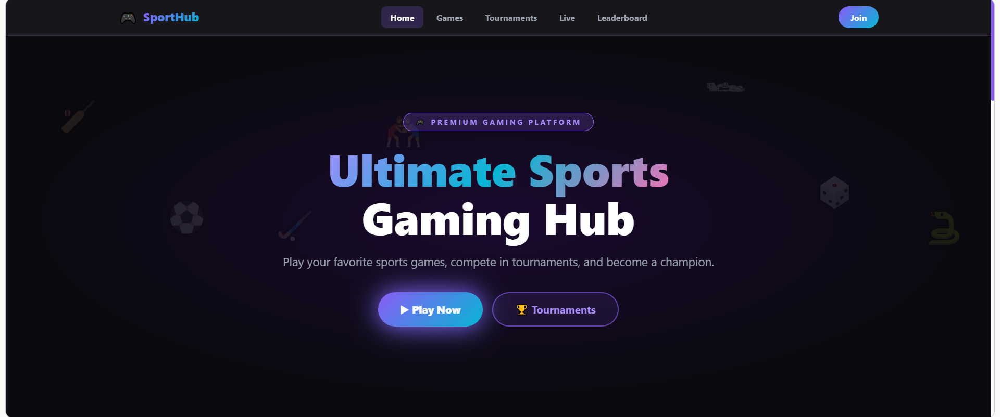
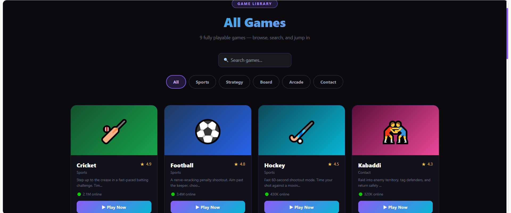
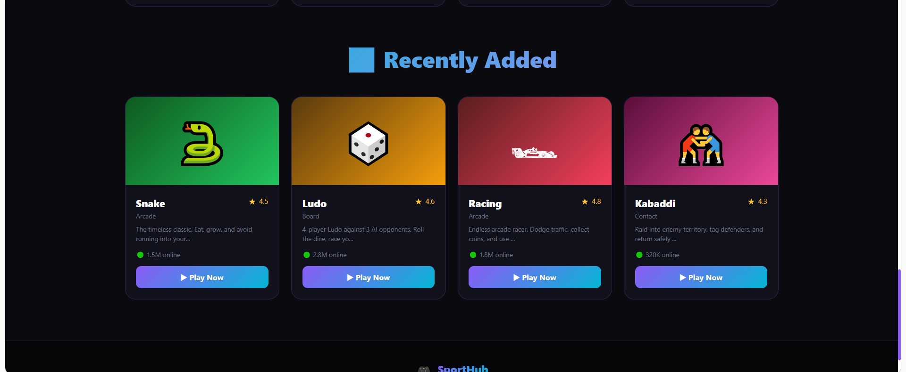
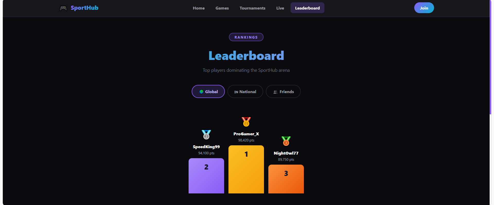

# 🎮 SportHub — Sports Gaming Platform

  
  
  
  

  <strong>A modern sports gaming platform featuring multiple playable games, tournaments, live matches, and leaderboards.</strong>

  

---

## 🎯 About The Project

**SportHub** is a responsive sports gaming platform designed to bring multiple
sports and arcade-style games together in one modern web experience.

The platform includes a game library, individual game pages, tournaments,
live match dashboards, player leaderboards, and responsive gameplay interfaces.

The project focuses on creating an engaging gaming experience using modern
frontend development techniques, reusable React components, responsive layouts,
animations, and HTML Canvas-based gameplay.

---

## 🖼️ Project Screenshots

### 🏠 SportHub Home

  

### 🎮 Gameplay

  

### 🏆 Tournaments

  

### 🥇 Leaderboard

  

---

## ✨ Key Features

- 🎮 Multiple playable sports and arcade games
- 🏏 Cricket gameplay
- ⚽ Football penalty shootout
- 🏑 Hockey shootout
- 🤼 Kabaddi
- ♟️ Chess
- 🎯 Carrom
- 🏎️ Racing
- 🎲 Ludo
- 🐍 Snake
- 🔍 Search and filter games
- 🏆 Tournament section
- 📺 Live match dashboard
- 🥇 Global leaderboard
- 🌍 National leaderboard
- 👥 Friends leaderboard
- 📊 Game statistics
- ⏱️ Tournament countdown timers
- 🎨 Modern dark gaming UI
- ✨ Animated interface
- 📱 Responsive design
- 🖥️ Desktop, tablet and mobile support
- 🎮 Keyboard and touch controls

---

## 🕹️ Game Library

| Game | Category | Difficulty |
|------|----------|------------|
| 🏏 Cricket | Sports | Medium |
| ⚽ Football | Sports | Easy – Hard |
| 🏑 Hockey | Sports | Medium |
| 🤼 Kabaddi | Contact | Easy – Pro |
| ♟️ Chess | Strategy | All Levels |
| 🎯 Carrom | Board | Medium |
| 🏎️ Racing | Arcade | Easy – Hard |
| 🎲 Ludo | Board | Easy |
| 🐍 Snake | Arcade | Easy |

---

## 🏆 Platform Sections

### 🎮 Game Library

Browse, search and filter games by category and quickly start playing.

### 🏆 Tournaments

View active, upcoming and completed tournaments with:

- Prize pools
- Participants
- Entry fees
- Countdown timers
- Tournament status

### 📺 Live Matches

A dedicated live dashboard displaying:

- Match scores
- Teams / players
- Match status
- Tournament information
- Live statistics

### 🥇 Leaderboard

Multiple leaderboard views:

- 🌍 Global
- 🇮🇳 National
- 👥 Friends

---

## 🛠️ Tech Stack

### Frontend

- React.js
- JavaScript ES6+
- HTML5
- CSS3
- Responsive Design

### Game Development

- HTML Canvas
- JavaScript Game Logic
- Keyboard Controls
- Touch Controls
- Animation & Game Loops

### Development

- React Hooks
- Context API
- Reusable Components
- Custom Routing
- Responsive CSS
- Git & GitHub

---

## 🧩 Technical Highlights

### ⚛️ Component-Based Architecture

The application uses reusable React components for common UI elements such as:

- Navbar
- Footer
- Game Cards
- Tournament Cards
- Leaderboard
- Game Shell
- Game Overlays
- Start Screens
- Pause Screens

### 🎮 Canvas-Based Games

Interactive games are implemented using HTML Canvas and JavaScript game
logic, including animation loops, keyboard controls and responsive sizing.

### 📱 Responsive Gameplay

The game interface adapts to different screen sizes and supports both
desktop keyboard controls and mobile touch interactions.

### 🧭 Client-Side Navigation

The platform provides navigation between:

- Home
- Games
- Game Details
- Play
- Tournaments
- Live Matches
- Leaderboard

---

## 🎬 Project Demo

  

---

## 🚀 Live Website

### 🌐 [Visit SportHub Live] https://claude.ai/public/artifacts/9f46d02c-0c9c-4f4a-aa61-0e511803c36c

---

## 📂 Project Type

This repository is maintained as a **project showcase and documentation
repository** for the live SportHub web application.

The live application was developed as a single-page React application and
published separately.

---

## 🤖 Development

This project was developed with **AI-assisted development** and refined with
frontend development practices including responsive design, component
architecture, game logic, UI/UX improvements and interactive features.

---

## 🔮 Future Improvements

- 🔐 User authentication
- 👤 Player profiles
- 💾 Persistent game scores
- 🏆 Real tournament participation
- 🌐 Multiplayer gameplay
- 💬 Real-time chat
- 🏅 Achievement system
- 📊 Player statistics
- ☁️ Backend integration
- 🗄️ Database integration
- 🔔 Notifications

---

## 👨‍💻 Developer

**Sudharsanan R**

Frontend Developer | React.js | JavaScript

---

  ⭐ If you found this project interesting, consider starring the repository.

